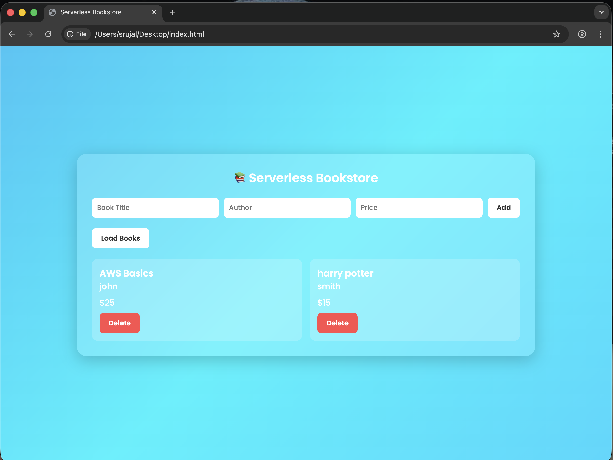
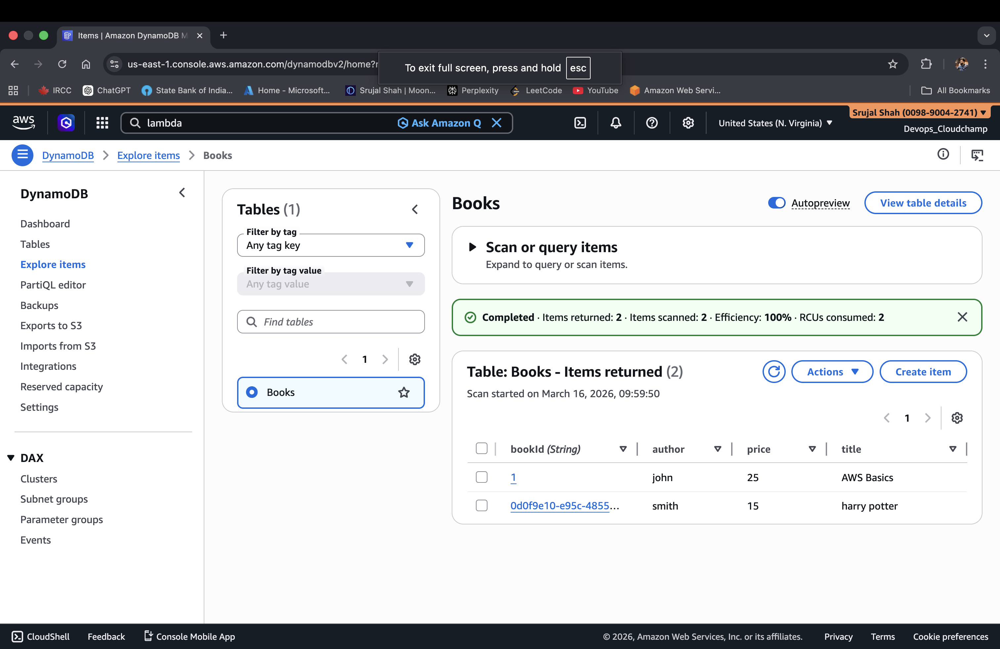

# 📚 Serverless Bookstore — AWS Serverless Architecture

A cloud-native bookstore web application built using AWS serverless services.  
This project demonstrates modern backend design using event-driven architecture, managed infrastructure, and scalable cloud services without provisioning servers.

---

## 🚀 Project Overview

The **Serverless Bookstore** is a fully managed web application that allows users to create, view, and delete book records through a RESTful API powered by AWS services.

The application follows **cloud-native and serverless principles**, focusing on scalability, reliability, and operational efficiency.

---

## 📸 Project Screenshots

### 🌐 Frontend UI

Modern animated bookstore interface built with HTML, CSS, and JavaScript.

  

---

### ⚡ Lambda + API Gateway Integration

Serverless backend powered by AWS Lambda exposed through API Gateway REST endpoints.

  

---

### 📦 DynamoDB Database

NoSQL storage managing book records with high availability and millisecond latency.

  

---

## ✨ Core Features

- 📖 Add books using REST API
- 📚 Fetch all books dynamically
- 🗑️ Delete books in real time
- ⚡ Event-driven backend using AWS Lambda
- 🌐 API-first architecture
- 🔄 Stateless compute layer
- 📦 NoSQL storage using DynamoDB
- 🎨 Modern animated frontend UI
- 🔓 CORS-enabled API integration
- ☁️ Fully serverless infrastructure

---

## 🏗 Architecture Overview
Frontend (HTML / JS)
│
▼
API Gateway (REST API)
│
▼
AWS Lambda (Business Logic)
│
▼
DynamoDB (NoSQL Database)

---

## ☁️ Cloud Architecture Principles

### Serverless Design

The system eliminates traditional servers by leveraging managed AWS services:

- **Compute** → AWS Lambda
- **API Management** → Amazon API Gateway
- **Database** → Amazon DynamoDB

This enables automatic scaling and reduced operational overhead.

---

### Event-Driven Execution

Each API request triggers a Lambda invocation:

Client Request → API Gateway → Lambda → DynamoDB → Response

**Benefits**

- No idle infrastructure
- Automatic scaling
- High concurrency handling

---

### Stateless Backend

Lambda functions are stateless:

- No session persistence
- Independent executions
- Horizontal scaling by default

Application state is externalized into DynamoDB following cloud-native best practices.

---

## 🧠 Senior-Level Engineering Insights

### 1️⃣ Scalability by Design

- API Gateway manages request routing and throttling
- Lambda scales automatically per invocation
- DynamoDB adaptive capacity handles traffic spikes

No manual autoscaling configuration required.

---

### 2️⃣ Cost Optimization Strategy

Serverless pricing ensures:

- Pay only for execution time
- Zero cost during inactivity
- No infrastructure maintenance

Ideal for startup workloads and burst traffic systems.

---

### 3️⃣ Separation of Concerns

| Layer | Responsibility |
|------|---------------|
| Frontend | User Interface |
| API Gateway | Routing & HTTP abstraction |
| Lambda | Business Logic |
| DynamoDB | Data Persistence |

This architecture improves maintainability and extensibility.

---

### 4️⃣ High Availability

AWS managed services provide:

- Multi-Availability Zone redundancy
- Built-in fault tolerance
- Automatic infrastructure recovery

---

### 5️⃣ Security Considerations

- IAM role-based permissions
- Principle of least privilege
- Backend isolated from frontend
- Controlled API exposure via API Gateway

---

### 6️⃣ Performance Characteristics

- Parallel Lambda execution
- DynamoDB single-digit millisecond latency
- Managed scaling without infrastructure tuning

---

### 7️⃣ Cloud-Native Patterns Demonstrated

- Serverless architecture
- Backend-as-a-Service (BaaS)
- API-first development
- Event-driven workflows
- Managed infrastructure model

---

## 📈 Engineering Tradeoffs

| Advantage | Tradeoff |
|-----------|----------|
| Automatic scaling | Cold start latency |
| Low operational overhead | Vendor lock-in |
| Pay-per-use pricing | Limited infrastructure control |
| Fast deployment | Distributed debugging complexity |

Understanding these tradeoffs is essential for real-world cloud system design.

---

## 🔮 Future Enhancements

- Authentication using Amazon Cognito
- Infrastructure as Code (Terraform / CloudFormation)
- CI/CD pipeline integration
- CloudFront CDN for frontend delivery
- Monitoring with CloudWatch dashboards
- API rate limiting & usage plans
- Structured logging & distributed tracing

---

## 🎯 Learning Outcomes

This project demonstrates practical understanding of:

- Serverless system design
- AWS managed service integration
- REST API architecture
- Stateless application patterns
- Cloud scalability principles

---

## 👨‍💻 Author

**Srujal Shah**  
Cloud & DevOps Engineer (Aspiring)  
Focused on AWS, DevOps, and Distributed Systems

---

⭐ If you found this project useful, consider giving it a star!
